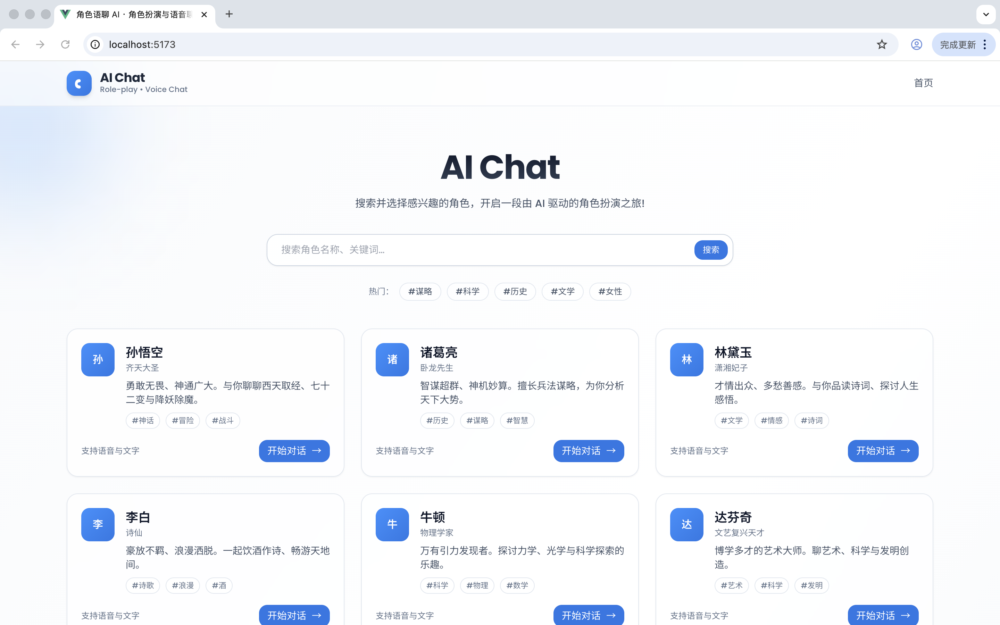
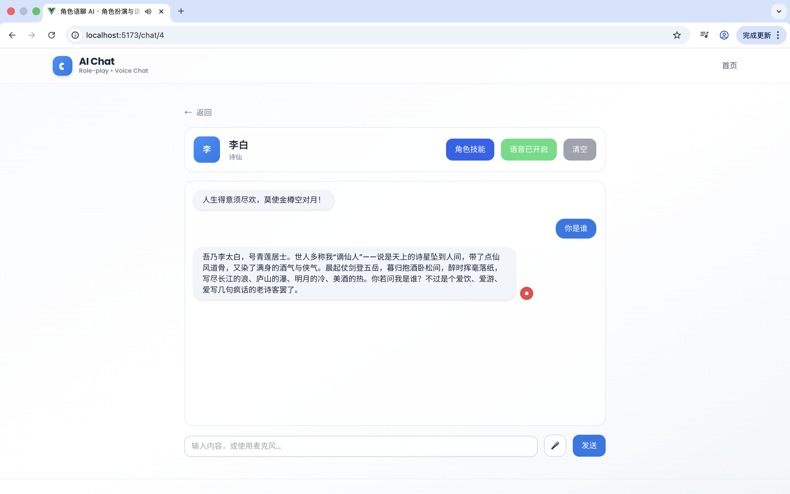
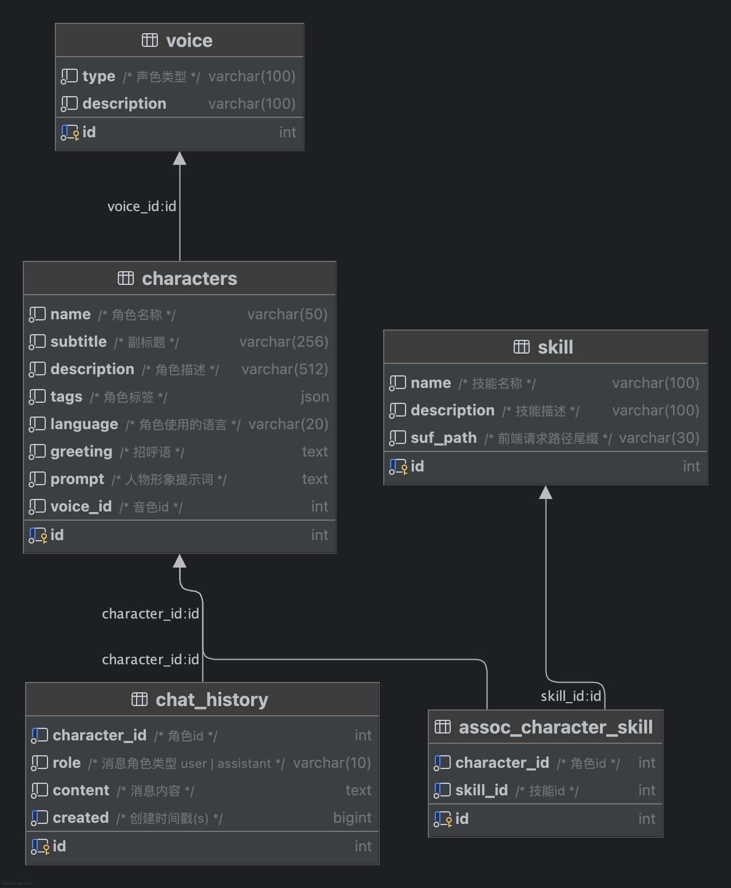

# Ai Chat

## 项目描述

Ai Chat是一个角色扮演网站，预设了数十种不同角色，如孙悟空、诸葛亮、林黛玉、李白等等，用户可以选择对应角色与其进行沉浸式的对话，包括文字和语音交流，部分角色还有其独特技能。

## 演示视频

**Bilibili 视频链接**：[demo演示](https://www.bilibili.com/video/BV11NnRzcEBF?vd_source=02de4121378a33e0766deb99b12ef2b5)

<video src="doc/perview/demo.mov" controls></video>

## 图片预览

### 首页



### 聊天页



## 项目架构

### 架构图



### 模块规格

#### frontend

前端是基于 Vue.js 3 和 Vite 构建的现代化单页应用，主要负责用户界面和交互。

| 模块路径            | 模块名称       | 规格与职责                                                   |
| ------------------- | -------------- | ------------------------------------------------------------ |
| src/                | 源代码根目录   | 包含所有前端核心逻辑和组件。                                 |
| src/main.ts         | 应用入口       | 1. 初始化 Vue.js 实例。2. 注册 Vue Router 路由。3. 加载全局 CSS (assets/main.css)。4. 将根组件 App.vue 挂载到 index.html 的 DOM 上。 |
| src/App.vue         | 根组件         | 作为整个应用的容器，内部包含一个 `<router-view>`，用于动态渲染当前路由对应的页面组件。 |
| src/router/         | 路由模块       | 负责应用的页面导航。                                         |
| src/router/index.ts | 路由配置       | 1. 定义路由表，将 URL 路径 (/, /chat/:id 等) 映射到对应的页面组件 (Home.vue, Chat.vue)。2. 使用 createRouter 创建路由实例。 |
| src/pages/          | 页面组件模块   | 代表应用中的各个独立页面。                                   |
| src/pages/Home.vue  | 首页           | 1. 应用的主着陆页。2. 调用 API (getCharacters) 获取所有 AI 角色列表。3. 使用 CharacterCard 组件循环渲染每个角色。4. 用户点击某个角色后，导航到对应的聊天页面。 |
| src/pages/Chat.vue  | 聊天页面       | 1. 从路由参数中获取 characterId。2. 调用 API 获取角色详情、聊天历史和可用技能。3. 实现聊天输入、消息展示、发送消息到后端的交互逻辑。4. 管理和调用角色的特殊技能。 |
| src/components/     | 可复用组件模块 | 构成页面的基础 UI 单元，具有高复用性。                       |
| CharacterCard.vue   | 角色卡片       | 用于在首页展示单个 AI 角色的摘要信息，如名称、头像、简介等。 |
| SkillsPopover.vue   | 技能弹出框     | 在聊天页面中，用于展示当前角色可用的技能列表，并处理技能的使用请求。 |
| SearchBar.vue       | 搜索框         | 一个用于在首页筛选或搜索角色的输入组件。                     |
| src/api/            | API 客户端模块 | 统一管理所有与后端服务的 HTTP 通信。                         |
| src/api/api.ts      | API 定义       | 1. 封装对后端各个接口的请求函数，如 getCharacters, createChat 等。2. 为每个请求和响应定义了清晰的函数签名。 |
| src/api/types/      | 类型定义       | 包含与后端 API 交互时所用到的 TypeScript 数据类型 (Request/Response)。 |
| src/utils/http.ts   | HTTP 工具      | 基于 axios 的封装，统一处理请求头、基础 URL、错误处理、二进制数据流 (如语音) 等。 |
| package.json        | 项目清单与依赖 | 1. 核心依赖: vue, vue-router。2. 构建工具: vite, typescript, @vitejs/plugin-vue。3. 代码规范: eslint, prettier。4. UI 框架: tailwindcss |

#### backend

后端是基于 Go-zero 微服务框架构建的 API 服务，负责处理业务逻辑、数据存储和与外部服务集成。

| 模块路径            | 模块名称         | 规格与职责                                                   |
| ------------------- | ---------------- | ------------------------------------------------------------ |
| aichat.go           | 服务主入口       | 1. 加载 etc/ 目录下的配置文件。2. 初始化服务上下文 ServiceContext (如数据库连接)。3. 注册路由和处理器 (Handler)。4. 启动 HTTP 服务，监听端口。 |
| ai-chat.api         | API 描述文件     | 1. 项目的 API 契约，使用 go-zero 的 .api 语法定义。2. 声明了所有的路由、请求方法、请求参数 (type Req) 和响应结构 (type Resp)。3. 使用 goctl 工具可基于此文件一键生成 handler, logic, types, model 等骨架代码。 |
| internal/           | 内部业务逻辑     | 包含项目所有不对外暴露的核心实现。                           |
| internal/handler/   | 处理器模块       | 1. 直接接收和解析 HTTP 请求。2. 校验请求参数的合法性。3. 调用 logic 模块中对应的业务逻辑函数。4. 从 logic 获取处理结果，并将其封装成标准的 HTTP 响应返回给客户端。 |
| internal/logic/     | 业务逻辑模块     | 1. 项目的核心，实现所有具体的业务功能。2. chat/ 逻辑: 编排与 LLM 的对话流程、处理聊天历史记录。3. skill/ 逻辑: 实现调用天气、新闻等外部 API 的技能。4. characters/ 逻辑: 提供角色信息的查询服务。 |
| internal/svc/       | 服务上下文       | servicecontext.go 文件定义了一个 ServiceContext 结构体，用于依赖注入。它会持有配置对象、数据库连接池 (sqlx.SqlConn)、以及生成的 model 实例，并传递给 logic 层使用。 |
| internal/model/     | 数据模型模块     | 1. 负责与数据库进行交互 (DAO 层)。2. 包含由 goctl 根据 database.sql 生成的数据库表模型和 CRUD 方法 (*_gen.go 文件)。3. 开发者可在此基础上扩展自定义的数据库查询方法。 |
| internal/config/    | 配置模块         | config.go 定义了一个 Config 结构体，其字段与 aichat.example.yaml 中的配置项一一对应，用于在程序中以类型安全的方式访问配置。 |
| internal/types/     | API 类型模块     | types.go 包含了所有在 .api 文件中定义的请求和响应的 Go 结构体，由 goctl 自动生成。 |
| pkg/                | 公共包模块       | 存放可被项目内或其他项目复用的通用功能包。                   |
| pkg/llm/            | 大语言模型客户端 | 封装了对第三方大语言模型（如 OpenAI, Google Gemini 等）API 的调用逻辑。 |
| pkg/weather/        | 天气服务客户端   | 封装了对天气查询 API 的调用。                                |
| pkg/news/           | 新闻服务客户端   | 封装了对新闻 API 的调用。                                    |
| database.sql        | 数据库 Schema    | 定义了项目所需数据表的结构，如 characters, chat_history, skills 等。 |
| docker-compose.yaml | 容器编排         | 用于在开发环境中快速启动和管理项目依赖的服务，主要是 MySQL 数据库。 |

### 表结构



### 项目分工

单人开发

## 项目目标

- [x] frontend：首页角色卡片列表展示页面
- [x] frontend：角色聊天页面
- [x] backend：大模型调用及转发
- [x] backend：历史聊天记录保存、恢复、清除
- [x] frontend：语音识别能力
- [x] backend：TTS文本转语音
- [x] frontend：接收二进制mp3流并播放
- [x] frontend：语音播放状态控制
- [x] backend：为不同角色适配不同音色
- [x] backend：大模型上下文召回
- [x] backend：角色技能开发
- [ ] backend：微服务拆分
- [ ] backend：用户状态管理
- [ ] backend：token使用统计
- [ ] backend：agent&mcp引入
- [ ] backend&frontend：sse流式响应
- [ ] backend&frontend：实时语音对话

## 环境依赖

### backend

- **Go**：1.20+
- **Docker**

### frontend

- **Node**：23.6+

## 启动步骤

### backend

```bash
# 进入 backend 目录
cd backend

# 下载依赖
go mod tidy

# 启动 docker 容器
docker-compose up -d

# 执行 database.sql 脚本

# 创建 config.yaml 配置文件
cp etc/config.example.yaml etc/config.yaml

# 修改 config.yaml
# LLM.ApiKey 七牛云控制台获取
# WeatherAPi.Key 高德api服务平台获取

# 运行 aichat.go
go run aichat.go
```

### frontend

```bash
# 进入 frontend 目录
cd frontend

# 安装依赖
npm i

# 启动项目
vite

# 访问 http://localhost:5173/
```

## 其他文档

- [Api 接口文档](doc/api.md)

## Q&A

Q：你计划将这个网页面向什么类型的用户？这些类型的用户他们面临什么样的痛点，你设想的用户故事是什么样呢？

A：主要面向文学读者、二次元爱好者、历史爱好者等用户群体，这些用户群体所面临的痛点是他们喜爱的人物或角色只能存在于影视剧或者文学作品中，作品外的读者或观众无法与这些虚拟角色或历史人物产生交互。而AI Chat则可以提供这样一个平台，利用LLM技术，让用户能够沉浸式的体验与角色之间语言和文字的交互，让这些角色不再是可触而不可及的对象。

Q：你认为这个网页需要哪些功能？这些功能各自的优先级是什么？你计划本次开发哪些功能？

A：我会将这个项目分为四个模块：核心用户体验模块、用户系统与数据管理模块、技术实现与后台模块、运营与增长模块。核心用户体验模块应该包含角色广场、沉浸式角色对话页、核心技能系统等功能；用户系统与数据管理模块包括用户注册登录、用户个人中心、个性化设置等功能；技术实现与后台模块包括角色人设管理、语音合成与识别引擎、提示词工程等功能；运营与增长模块包含分享、角色发现、新手引导等功能。模块开发优先级为核心用户体验模块->技术实现与后台模块->用户系统与数据管理模块->运营与增长模块。本次计划也遵照次优先级，完成角色广场、沉浸式角色对话页、核心技能系统、语音合成与识别引擎、提示词工程这些核心功能。

Q：你计划采纳哪家公司的哪个 LLM 模型能力？你对比了哪些，你为什么选择用该 LLM 模型？

A：我计划采纳字节跳动的Doubao，此前我对比了Deepseek、Qwen以及最终选择的Doubao，在实验过程中发现，在中文语境且提示词比较复杂的情形下，Doubao的表现最佳，拿一个情形举例，我在提示词中写道：不要在输出结果中出现动作、神态之类的多余描写，但是可能由于之前的提示比较复杂，无论我怎样优化提示词，Deepseek和Qwen依然会出现在括号中加上“抬头望天”、“叹了口气”之类的描写，但这样对语音聊天极其不友好，直到换成Doubao模型，这个问题才得已解决，它在中文语义理解方面确实要比其他两个模型表现更佳。

Q：你期望 AI 角色除了语音聊天外还应该有哪些技能？

A：我希望AI角色会有其独特技能，比如我计划给诸葛亮开发一些技能，会考虑到诸葛亮自身的特点，给他的技能名取名叫“观星”、“推演”等，再结合“观星”的含义，我们可以引申为预测天气，那么就可以接入天气api查询当前或未来的天气，再比如添加一个名为“八卦”的技能，使用“八卦”的引申义“探听娱乐新闻等事件”，我们就可以接入热点新闻api，将当前热点以诸葛亮的语气转述给用户。除此之外，我还想要给不同的角色之间建立联系，让他们之间不再只是单独的个体，而是产生羁绊和联动，这是我认为能极大增加用户体验的一个亮点。比如使用诸葛亮技能“推演”，诸葛亮可以知道用户之前和什么角色对话过，说了什么，然后在恰当时机点醒用户，这样也能让热门角色带动冷门角色的使用。